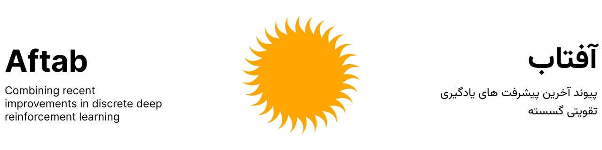

<div align="center">
  
</div>

<p align="center">
  
  
  
  
</p>

<p align="center">
  
  
  
</p>


## Overview

**Aftab** (آفتاب) is a benchmarking framework for evaluating CNN-based encoders in PQN across Atari environments.  
It provides standardized training, evaluation, and reproducibility tools for deep reinforcement learning research.


<div align="center">

| IQM HNS | IQM HNS (Last 50M Frames) |
| :---: | :---: |
|  |  |

</div>

<p align="center"><em>Global performance of base encoders.</em></p>

<div align="center">

| IQM HNS | IQM HNS (Last 50M Frames) |
| :---: | :---: |
|  |  |

</div>

<p align="center">
  <em>
  Comparison of two Gamma encoder variants based on findings from 
  <a href="https://arxiv.org/abs/2505.15345">
    Hadamax Encoding: Elevating Performance in Model-Free Atari
  </a>.
  </em>
</p>


## Installation

Install via pip:

```bash
pip install aftab
```


## Usage

```python
from aftab import Aftab
from aftab import aftab_environments

seeds = [1, 2, 3, 4]

for environment in aftab_environments:
    agent = Aftab(encoder="gamma", frames="pilot")
    for seed in seeds:
        agent.train(environment=environment, seed=seed)
        agent.log()
```


## Defining a Custom Encoder

You can define your own encoder as a PyTorch module and pass it to the agent:

```python
import torch
from aftab import Aftab

class CustomImageEncoder(torch.nn.Module):
    def __init__(self):
        super().__init__()
  
    def forward(self, x):
        pass

agent = Aftab(encoder=CustomImageEncoder, frames="pilot")
```


## Results

**Base Encoder Experiments**
- [HNS](results/base_experiments/human_normalized_scores.md)
- [Scores](results/base_experiments/scores.md)

**Hadamax Experiments**
- [HNS](results/hadamax_experiments/human_normalized_scores.md)
- [Scores](results/hadamax_experiments/scores.md)

> **Note:** The Eta variant has significantly more parameters than other variants, primarily due to the encoder producing a large number of features.


## Parameter Count

<div align="center">

### Base Encoder Variations

| Variant  | Encoder Parameters | Q Regression Head | Total Parameters |
|----------|------------------|------------------|------------------|
| PQN      | 78,304           | 1,686,500        | 1,764,804        |
| Alpha    | 174,752          | 1,782,948        | 1,957,700        |
| Beta     | 89,008           | 1,782,948        | 1,871,956        |
| Gamma    | 117,168          | 1,725,364        | 1,842,532        |
| Delta    | 78,552           | 1,850,588        | 1,929,140        |
| Epsilon  | 80,112           | 2,179,828        | 2,259,940        |
| Zeta     | 77,232           | 2,537,396        | 2,614,628        |
| Eta      | 78,400           | 23,739,460       | 23,817,860       |
| Theta    | 76,288           | 1,127,428        | 1,203,716        |

### Hadamax Variants

| Variant           | Encoder Parameters | Q Regression Head | Total Parameters |
|-------------------|--------------------|-------------------|------------------|
| PQN Hadamax       | 156,608            | 3,968,516         | 4,125,124        |
| Gamma Hadamax V1  | 234,336            | 1,609,220         | 1,843,556        |
| Gamma Hadamax V2  | 234,336            | 3,280,388         | 3,514,724        |

</div>


## Hyperparameters

<div align="center">

| Hyperparameter | Value |
| :--- | :--- |
| Learning rate | $2.5 \times 10^{-4}$ |
| Training environments | 128 |
| Test environments | 8 |
| Optimizer | [Rectified Adam](https://arxiv.org/abs/1908.03265) |
| Weight decay | 0 |
| $\epsilon$ | $1 \times 10^{-5}$ |
| $\beta_{1}$ | 0.9 |
| $\beta_{2}$ | 0.999 |
| Total Frames | 200,000,000 |
| Loss function | Mean Squared Error |
| Scheduler | Linear Annealing |
| $\epsilon$-greedy exploration | 10% of total frames |
| Discount factor ($\gamma$) | 0.99 |
| GAE ($\lambda$) | 0.65 |
| Epochs | 2 |
| Batch size | 4096 |

</div>

<p align="center"><em>Used in encoder and Hadamax experiments.</em></p>

## Statistical Significance

<div align="center">

|         |   PQN |   Alpha |   Beta |   Gamma |   Delta |   Epsilon |   Zeta |   Eta |   Theta |
|:--------|------:|--------:|-------:|--------:|--------:|----------:|-------:|------:|--------:|
| PQN     | -     |   -     |  -     |   -     |   -     |     -     |  -     | -     |   -     |
| Alpha   | 0     |   -     |  -     |   -     |   -     |     -     |  -     | -     |   -     |
| Beta    | 0     |   0.847 |  -     |   -     |   -     |     -     |  -     | -     |   -     |
| Gamma   | 0     |   0.295 |  0.802 |   -     |   -     |     -     |  -     | -     |   -     |
| Delta   | 0     |   0     |  0     |   0     |   -     |     -     |  -     | -     |   -     |
| Epsilon | 0     |   0.104 |  0.068 |   0.01  |   0     |     -     |  -     | -     |   -     |
| Zeta    | 0     |   0.145 |  0.293 |   0.024 |   0     |     0.552 |  -     | -     |   -     | 
| Eta     | 0.001 |   0.337 |  0.757 |   0.221 |   0     |     0.819 |  0.967 | -     |   -     | 
| Theta   | 0.431 |   0     |  0.004 |   0     |   0.046 |     0.001 |  0.001 | 0.002 |   -     |

</div>

<div align="center">

|                    |   Gamma |   Hadamax Gamma V1 |   Hadamax Gamma V2 |   Hadamax |
|:-------------------|--------:|-------------------:|-------------------:|----------:|
| Gamma              |       - |              -     |              -     |     -     |
| Hadamax Gamma V1   |       0 |              -     |              -     |     -     |
| Hadamax Gamma V2   |       0 |              0.72  |              -     |     -     |
| Hadamax Nature DQN |       0 |              0.078 |              0.151 |     -     |

</div>

## Reproducibility

Due to the stochastic nature of deep reinforcement learning, exact reproducibility via fixed datasets is not feasible.  
Instead, we provide a set of random seeds used in our experiments.

```python
from aftab import aftab_seeds

print(aftab_seeds)
```

Full experiment replication:

```python
from aftab import Aftab
from aftab import aftab_environments
from aftab import aftab_seeds

for environment in aftab_environments:
    agent = Aftab()
    for seed in aftab_seeds:
        agent.train(environment=environment, seed=seed)
        agent.log()
```

A comprehensive set of Atari environments is available via EnvPool:  
https://envpool.readthedocs.io/en/latest/env/atari.html#available-tasks

## Citation

```
@article{aftab2026benchmarking,
  title={Aftab: Benchmarking {CNN} Encoders in {PQN}},
  author={Shieenavaz, Taha and Zareshahraki, Shabnam and Nanni, Loris},
  journal={arXiv preprint arXiv:YYMM.NNNNN},
  year={2026}
}
```

## License

© 2025 Taha Shieenavaz.  
Licensed under CC BY-NC 4.0: https://creativecommons.org/licenses/by-nc/4.0/