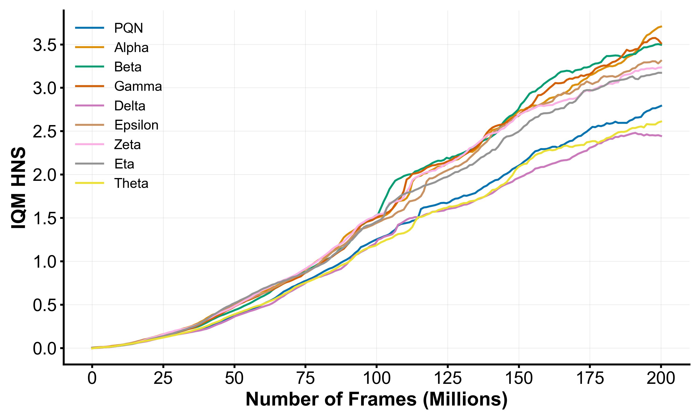
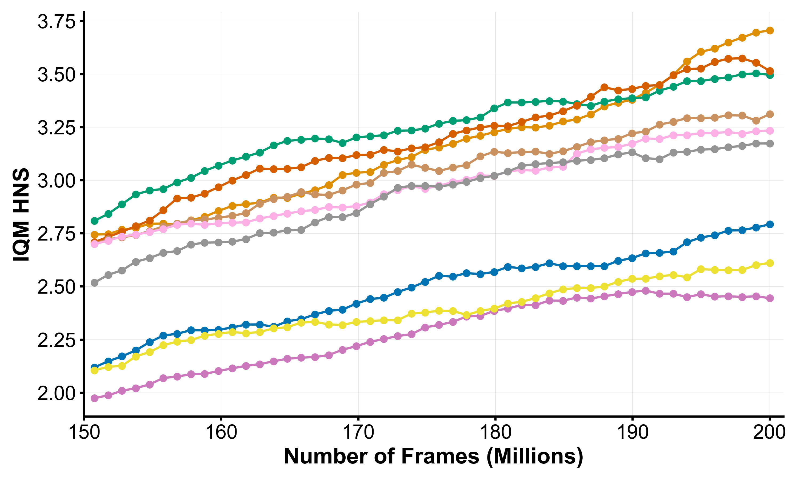

<p align="center">

| IQM HNS | IQM HNS (Last 50M Frames) |
| :---: | :---: |
|  |  |

</p>

## Installation

We have composed the whole project inside an installable Python library. You can install the package using pip.

```
pip install aftab
```

## Usage

You can import the agent and configure all the hyper-parameters based on following guide.

```python
from aftab import Aftab

seeds = [1, 2, 3, 4]
environments = ["Pong-v5", "IceHockey-v5"]

for environment in environments:
  agent = Aftab(environment=environment, encoder="gamma")
  for seed in seeds:
    agent.train(frames=200_000_000)
    agent.save(environment=environment, seed=seed, name="MyCustomAftabTests")
```


## Results

**Note:** In interpreting the results bear in mind that the Eta version has significantly more parameters compared to other variants, principally due to the the encoder yielding a large number of features. (<a href="#parameter-count">see</a>)

|                      | PQN        | Alpha      | Beta       | Gamma      | Delta      | Epsilon    | Zeta       | Eta         | Theta      |
|:---------------------|:-----------|:-----------|:-----------|:-----------|:-----------|:-----------|:-----------|:------------|:-----------|
| Alien                | 0.542      | 1.785      | 2.408      | **2.845**  | 0.381      | 2.262      | 1.840      | 1.675       | 0.411      |
| Amidar               | 0.640      | 1.346      | 0.862      | 1.038      | 0.529      | **1.381**  | 0.726      | 1.023       | 0.665      |
| Assault              | 30.169     | 24.547     | 28.574     | **35.629** | 24.864     | 34.124     | 29.913     | 34.288      | 35.067     |
| Asterix              | **40.617** | 15.338     | 14.821     | 14.311     | 38.146     | 10.255     | 12.616     | 22.730      | 38.306     |
| Asteroids            | 0.034      | **1.828**  | 0.349      | 1.438      | 0.223      | 1.039      | 1.752      | 0.064       | 0.026      |
| Atlantis             | 47.172     | 43.482     | 44.532     | 46.336     | 42.942     | **47.557** | 45.964     | 44.951      | 46.165     |
| Bank Heist           | 1.885      | 2.001      | 2.112      | 1.721      | 1.836      | 1.699      | **2.131**  | 1.718       | 1.949      |
| Battle Zone          | 1.212      | 1.425      | 1.894      | 1.880      | 1.197      | **2.121**  | 1.538      | 1.067       | 1.073      |
| Beam Rider           | 1.144      | **2.973**  | 2.355      | 2.388      | 1.069      | 1.997      | 1.591      | 1.348       | 1.152      |
| Berzerk              | 2.251      | **4.676**  | 0.343      | 1.227      | 1.364      | 1.475      | 2.984      | 0.868       | 1.368      |
| Bowling              | 0.044      | 0.100      | 0.037      | **0.133**  | 0.075      | 0.059      | 0.092      | 0.113       | 0.056      |
| Boxing               | 8.244      | **8.325**  | 8.297      | 8.285      | **8.325**  | 8.324      | 8.310      | **8.325**   | 8.319      |
| Breakout             | 12.019     | 15.045     | 15.712     | 16.763     | 11.809     | 12.695     | 12.870     | **17.246**  | 14.332     |
| Centipede            | 0.828      | 1.300      | 0.990      | **1.473**  | 0.693      | 0.955      | 0.665      | 1.120       | 0.540      |
| Chopper Command      | 2.679      | 24.380     | 47.179     | **55.506** | 0.839      | 40.922     | 31.491     | 3.387       | 1.515      |
| Crazy Climber        | 6.268      | 6.594      | **7.767**  | 6.467      | 6.786      | 7.175      | 6.645      | 6.839       | 6.152      |
| Defender             | 3.173      | 4.566      | 4.316      | **5.861**  | 3.155      | 3.876      | 3.967      | 3.259       | 5.806      |
| Demon Attack         | 72.523     | 72.842     | **73.151** | 72.884     | 70.913     | 72.627     | 72.075     | 71.496      | 70.971     |
| Double Dunk          | 7.763      | 7.783      | 7.960      | 7.804      | 7.571      | 7.869      | 7.732      | **8.171**   | 7.605      |
| Enduro               | 2.723      | **2.737**  | 2.709      | 2.693      | 2.724      | 2.711      | 2.697      | 2.696       | 2.710      |
| Fishing Derby        | 2.525      | 2.623      | 2.545      | 2.590      | 2.459      | 2.652      | **2.655**  | 2.559       | 2.509      |
| Freeway              | 1.132      | **1.148**  | 1.140      | 1.112      | 1.136      | 1.137      | 1.140      | 1.140       | 1.136      |
| Frostbite            | 1.545      | **2.564**  | 2.318      | 2.172      | 1.179      | 1.494      | 2.108      | 1.804       | 1.075      |
| Gopher               | 24.506     | 25.816     | **33.980** | 29.682     | 17.045     | 21.291     | 24.041     | 31.583      | 18.757     |
| Gravitar             | 0.235      | 0.267      | 0.396      | 0.353      | 0.188      | 0.255      | 0.328      | **0.510**   | 0.118      |
| Hero                 | 0.782      | 0.849      | 0.754      | 0.719      | 0.694      | 0.788      | 0.883      | **1.069**   | 0.448      |
| Ice Hockey           | 0.850      | 1.183      | 1.065      | **1.890**  | 0.703      | 1.050      | 1.056      | 1.253       | 0.631      |
| James Bond           | 8.134      | 12.279     | 6.875      | 17.127     | 4.725      | **28.243** | 12.081     | 13.439      | 8.514      |
| Kangaroo             | 4.480      | **4.801**  | 4.773      | 4.623      | 4.068      | 4.584      | 4.688      | 4.518       | 4.652      |
| Krull                | 7.621      | 8.625      | **8.707**  | 8.474      | 7.064      | 8.117      | 8.678      | 8.008       | 7.655      |
| Kung Fu Master       | 1.415      | 1.776      | 1.487      | 1.377      | 1.579      | 1.412      | 1.517      | 1.478       | **1.791**  |
| Montezuma's Revenge  | 0.000      | 0.000      | 0.000      | 0.000      | 0.000      | 0.000      | 0.002      | **0.004**   | 0.000      |
| Ms. Pac-Man          | 0.454      | 0.681      | 0.952      | 0.812      | 0.515      | 0.745      | 0.801      | **1.112**   | 0.657      |
| Name This Game       | 2.278      | 2.825      | 2.561      | **3.240**  | 2.322      | 2.275      | 2.251      | 1.877       | 2.579      |
| Phoenix              | 24.840     | 41.930     | 38.203     | 33.452     | 7.793      | 29.553     | **42.589** | 38.638      | 13.875     |
| Pitfall!             | 0.032      | 0.033      | 0.026      | 0.033      | **0.034**  | 0.033      | **0.034**  | 0.033       | 0.030      |
| Pong                 | **1.181**  | **1.181**  | **1.181**  | **1.181**  | **1.181**  | **1.181**  | **1.181**  | **1.181**   | **1.181**  |
| Private Eye          | **0.012**  | 0.000      | 0.001      | 0.001      | -0.000     | 0.000      | 0.000      | -0.000      | 0.001      |
| Q*bert               | 1.572      | 1.851      | 1.874      | 1.816      | 1.332      | 1.762      | 1.860      | **1.881**   | 1.647      |
| River Raid           | 1.355      | 1.672      | 1.669      | 1.737      | 1.405      | 1.731      | **1.819**  | 1.495       | 1.378      |
| Road Runner          | 7.268      | 10.362     | 10.011     | **21.188** | 7.391      | 10.825     | 11.094     | 7.851       | 7.007      |
| Robotank             | 7.109      | **7.435**  | 7.254      | 6.960      | 7.263      | 7.185      | 7.369      | 6.577       | 6.855      |
| Seaquest             | 0.187      | 0.235      | 0.194      | 0.201      | 0.198      | 0.210      | 0.407      | **0.409**   | 0.192      |
| Skiing               | -0.581     | 0.457      | -0.179     | -0.393     | -0.500     | **0.554**  | 0.496      | 0.541       | -0.388     |
| Solaris              | 0.111      | 0.074      | 0.153      | 0.190      | 0.077      | 0.133      | 0.117      | 0.180       | **0.282**  |
| Space Invaders       | 4.841      | 3.929      | 8.819      | 5.266      | 4.504      | 5.061      | 1.731      | **15.333**  | 4.159      |
| Star Gunner          | 27.278     | 38.522     | **43.751** | 42.478     | 24.829     | 32.671     | 31.591     | 24.522      | 24.052     |
| Surround             | 1.069      | 1.139      | 1.161      | 1.123      | 0.928      | 1.141      | **1.198**  | 1.197       | 0.946      |
| Tennis               | 1.381      | 2.290      | 1.375      | **2.676**  | 1.459      | 2.266      | 1.363      | 1.875       | 1.402      |
| Time Pilot           | 5.901      | 15.564     | **20.210** | 14.657     | 4.866      | 12.508     | 12.864     | 14.877      | 4.423      |
| Tutankham            | 1.519      | 1.571      | 1.557      | 1.538      | 1.512      | 1.498      | 1.536      | **1.601**   | 1.543      |
| Up 'n Down           | 23.231     | 23.353     | 23.545     | 24.046     | 16.812     | 27.409     | **27.981** | 7.877       | 24.057     |
| Venture              | 0.000      | 0.000      | **0.018**  | 0.001      | 0.000      | 0.000      | 0.000      | 0.000       | 0.000      |
| Video Pinball        | 315.049    | 365.167    | 312.556    | 366.645    | 359.358    | 302.946    | 365.137    | **372.327** | 344.773    |
| Wizard of Wor        | 4.443      | 7.319      | 7.254      | 6.468      | 3.191      | 7.742      | 6.266      | **8.059**   | 5.384      |
| Yars' Revenge        | 2.222      | 2.632      | 2.559      | 2.550      | 1.820      | 2.373      | **2.722**  | 2.653       | 2.198      |
| Zaxxon               | 1.834      | 2.109      | **2.539**  | 2.306      | 1.739      | 1.617      | 1.727      | 2.267       | 1.904      |
| Median               | **1.885**      | **2.623**  | **2.408**      | **2.550**      | **1.579**      | **2.262**      | **2.108**      | **1.877**       | **1.791**      |
| IQM   | **2.692**      | **3.536**  | **3.472**      | **3.481**      | **2.374**      | **3.315**      | **3.207**      | **3.114**       | **2.649**      |

## Parameter Count

<div align="center">

| Variant  | Encoder Parameters | Regression Head | Total Parameters |
|----------|------------------|-----------------|------------------|
| PQN      | 78,304           | 1,686,500       | 1,764,804        |
| Alpha    | 174,752          | 1,782,948       | 1,957,700        |
| Beta     | 89,008           | 1,782,948       | 1,871,956        |
| Gamma    | 117,168          | 1,725,364       | 1,842,532        |
| Delta    | 78,552           | 1,850,588       | 1,929,140        |
| Epsilon  | 80,112           | 2,179,828       | 2,259,940        |
| Zeta     | 77,232           | 2,537,396       | 2,614,628        |
| Eta      | 78,400           | 23,739,460      | 23,817,860       |
| Theta    | 76,288           | 1,127,428       | 1,203,716        |

</div>

## Hyperparameters

<div align=center>

| Hyperparameter | Value |
| :--- | :--- |
| Learning rate | $2.5 \times 10^{-4}$ |
| Training environments | 128 |
| Test environments | 8 |
| Optimizer | [Rectified Adam](https://arxiv.org/abs/1908.03265) |
| Weight decay | 0 |
| Adam $\epsilon$ | $1 \times 10^{-5}$ |
| Total Frames | 200,000,000 |
| Loss function | Mean Squared Error |
| Scheduler | Linear Annealing |
| $\epsilon$-greedy exploration | 10% of total frames |
| Discount factor ($\gamma$) | 0.99 |
| GAE parameter ($\lambda$) | 0.65 |
| Epochs | 2 |
| Batch size | 4096 |

</div>

## Statistical Significance

<!-- <p align="center">
    
</p> -->

<div align="center">

|         |   PQN |   Alpha |   Beta |   Gamma |   Delta |   Epsilon |   Zeta |   Eta |   Theta |
|:--------|------:|--------:|-------:|--------:|--------:|----------:|-------:|------:|--------:|
| PQN     | 1     |   0     |  0     |   0     |   0     |     0     |  0     | 0.001 |   0.431 |
| Alpha   | 0     |   1     |  0.847 |   0.295 |   0     |     0.104 |  0.145 | 0.337 |   0     |
| Beta    | 0     |   0.847 |  1     |   0.802 |   0     |     0.068 |  0.293 | 0.757 |   0.004 |
| Gamma   | 0     |   0.295 |  0.802 |   1     |   0     |     0.01  |  0.024 | 0.221 |   0     |
| Delta   | 0     |   0     |  0     |   0     |   1     |     0     |  0     | 0     |   0.046 |
| Epsilon | 0     |   0.104 |  0.068 |   0.01  |   0     |     1     |  0.552 | 0.819 |   0.001 |
| Zeta    | 0     |   0.145 |  0.293 |   0.024 |   0     |     0.552 |  1     | 0.967 |   0.001 |
| Eta     | 0.001 |   0.337 |  0.757 |   0.221 |   0     |     0.819 |  0.967 | 1     |   0.002 |
| Theta   | 0.431 |   0     |  0.004 |   0     |   0.046 |     0.001 |  0.001 | 0.002 |   1     |

</div>

## Reproducibility

As in the deep reinforcement learning context providing a standalone dataset which is used to conduct researcher's experiments is not possible, we present to you the list of the seeds which has been used to perform our experiments. That can be used to replicate our results spotlessly. 

```py
from aftab import Aftab

seeds = [475284, 219842, 525975, 909314]
# the rest of the code
```

Trivially, our seeds themselves were generated randomly using [Python random library](https://docs.python.org/3/library/random.html) as well. 

## Available Atari Environments

A comprehensive set of Atari environments has been developed by the professional [maintainers](https://github.com/sail-sg/envpool/graphs/contributors) of the library [EnvPool](https://github.com/sail-sg/envpool) which could be found [here](https://envpool.readthedocs.io/en/latest/env/atari.html#available-tasks). 

Aftab takes the input environment variable and passes it directly to EvnPool library. Therefore, feel free to refer to the aforementioned list as your project necessitates.


## Citation

Please cite this work should you find that useful.

```
@article{aftab2026benchmarking,
  title={Aftab: Benchmarking {CNN} Encoders in {PQN}},
  author={Shieenavaz, Taha and Zareshahraki, Shabnam and Nanni, Loris},
  journal={arXiv preprint arXiv:YYMM.NNNNN},
  year={2026}
}
```