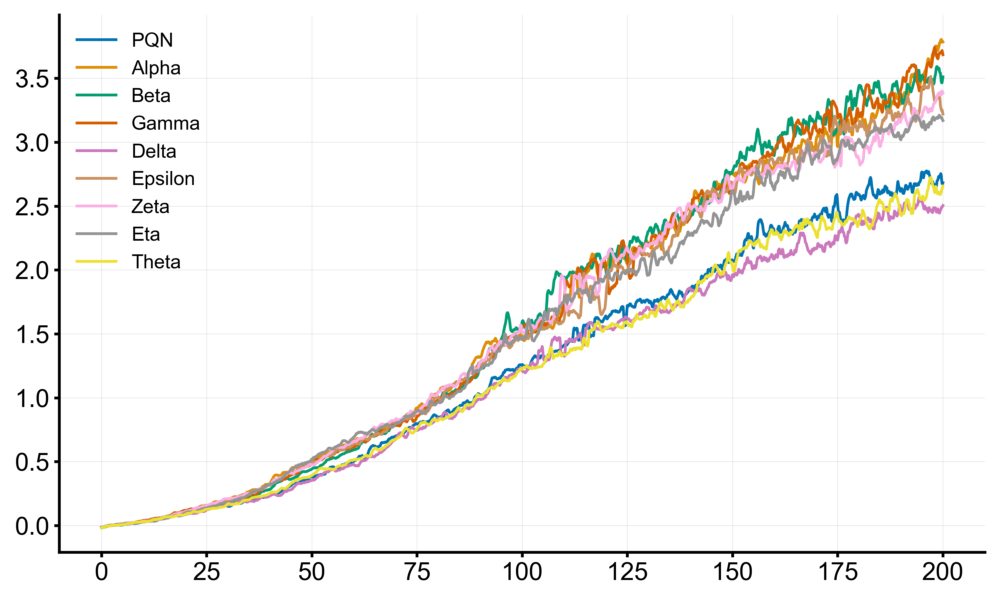
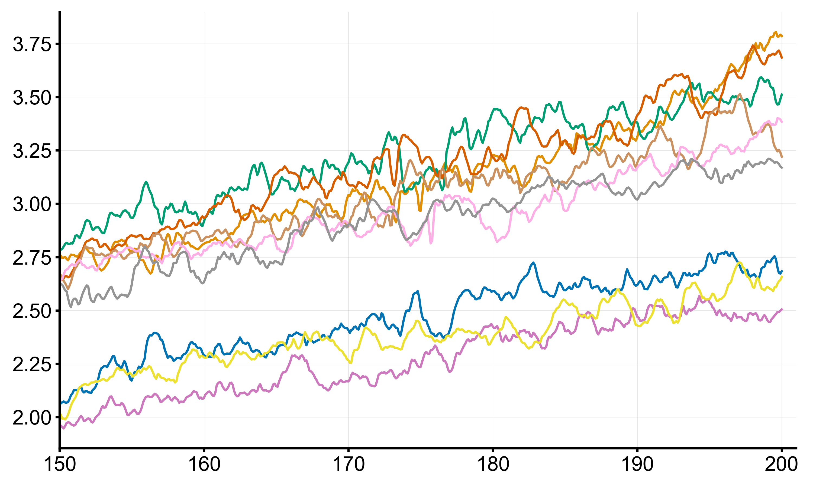
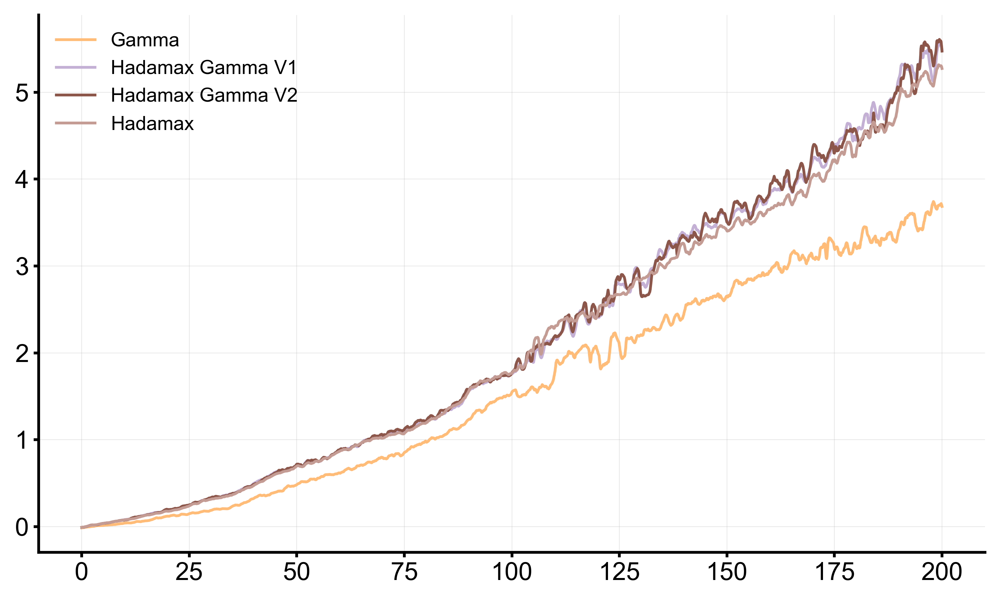
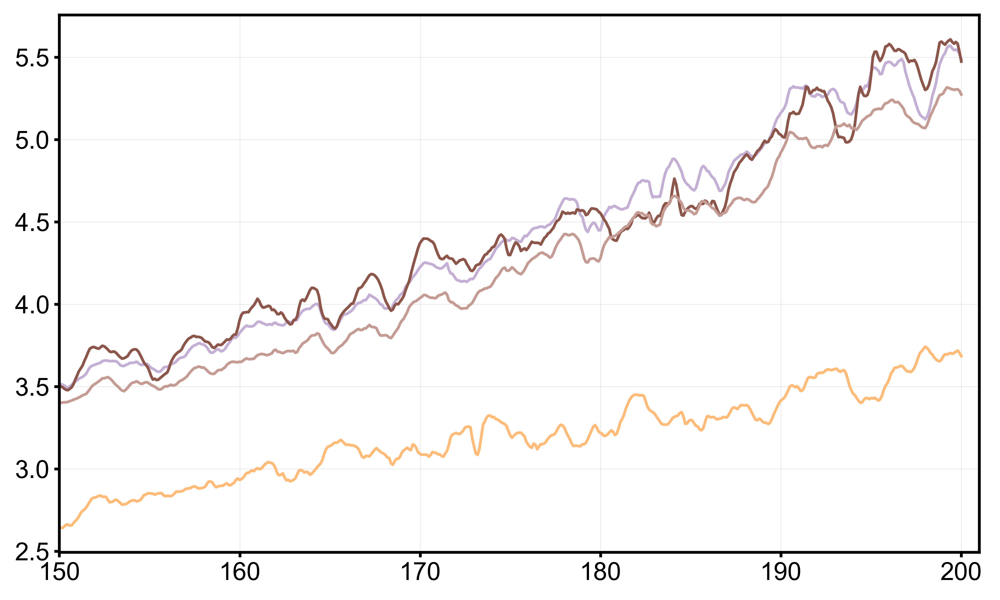
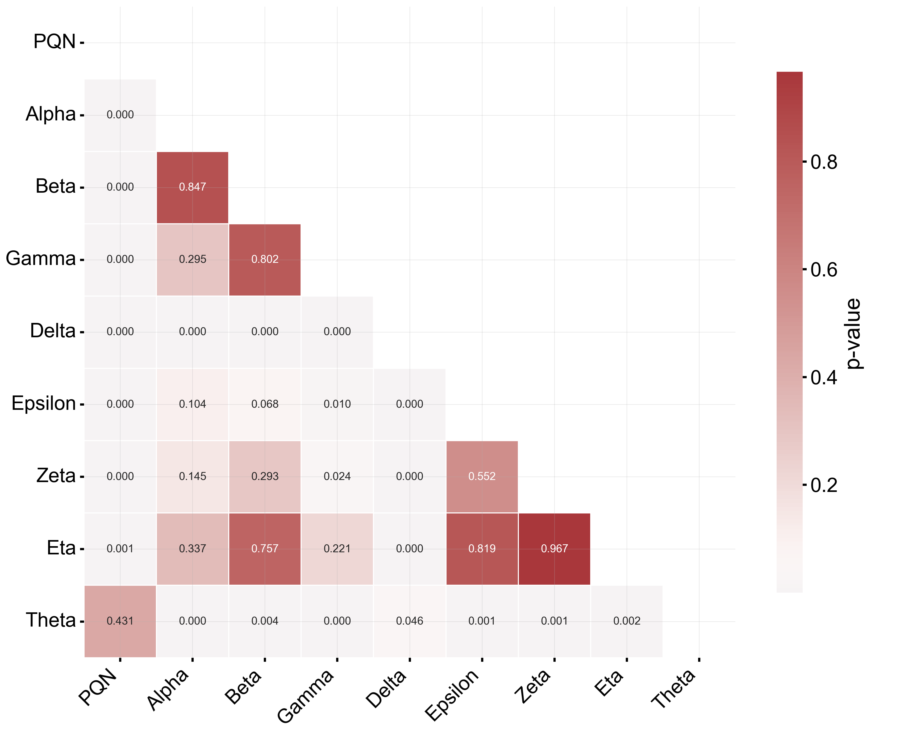
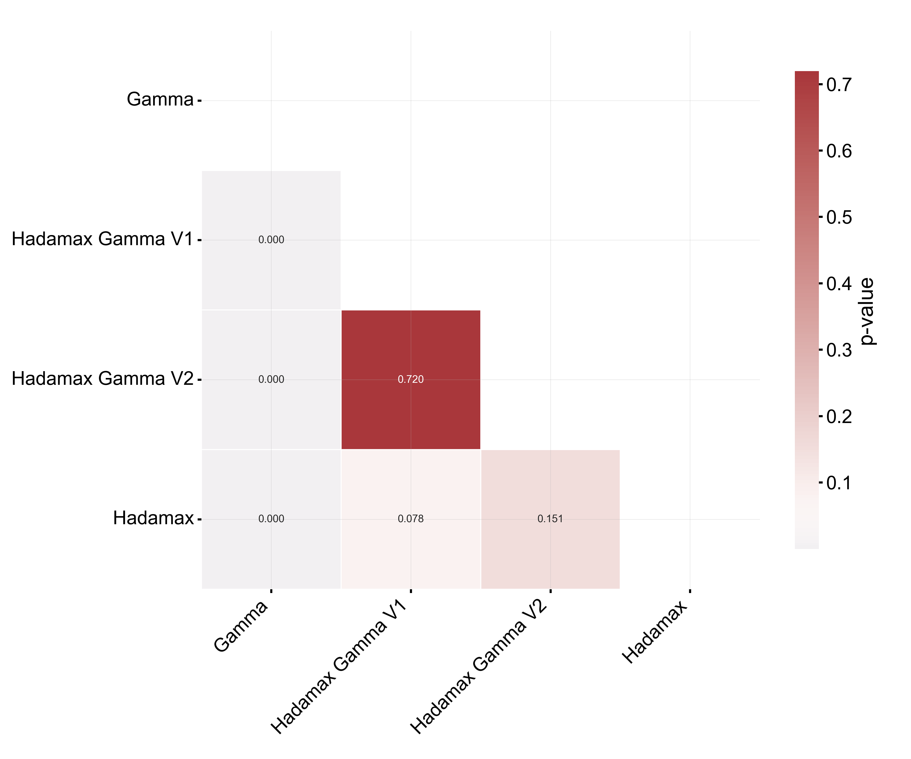

<div align="center">

| IQM HNS | IQM HNS (Last 50M Frames) |
| :---: | :---: |
|  |  |

</div>

<p align="center">Global Performance of base encoders proposed in this work.</p>

<div>

| IQM HNS | IQM HNS (Last 50M Frames) |
| :---: | :---: |
|  |  |

</div>

<p align="center">
  Comparing two distinct variants of Gamma encoder based on the findings in <a href="https://arxiv.org/abs/2505.15345">Hadamax Encoding: Elevating Performance in Model-Free Atari</a>
</p>

## Installation

We have composed the whole project inside an installable Python library. You can install the package using pip.

```
pip install aftab
```

## Usage

You can import the agent and configure all the hyper-parameters based on following guide.

```python
from aftab import Aftab
from aftab import aftab_environments

seeds = [1, 2, 3, 4]

for environment in aftab_environments:
  agent = Aftab(encoder="gamma", frames="pilot")
  for seed in seeds:
    agent.train(environment=environment, seed=seed)
    agent.log()
```

## Defining Custom Encoder

You can simply define your custom encoders as a PyTorch module and pass it to the agent when initializing it. Aftab recognizes this and runs the experiments using your custom module.

```py
import torch
from aftab import Aftab

class CustomImageEncoder(torch.nn.Module):
  def __init__(self):
    super().__init__()
  
  def forward(self, x):
    pass

agent = Aftab(encoder=CustomImageEncoder, frames="pilot")
```


## Results

- Encoders Experiments: [HNS](results/base_experiments/human_normalized_scores.md) | [Scores](results/base_experiments/scores.md)

- Hadamax Experiments: [HNS](results/hadamax_experiments/human_normalized_scores.md) | [Scores](results/hadamax_experiments/scores.md)

**Note:** In interpreting the results bear in mind that the Eta version has significantly more parameters compared to other variants, principally due to the the encoder yielding a large number of features. (<a href="#parameter-count">see</a>)

## Parameter Count

<div align="center">

### Base Encoder Variations

| Variant  | Encoder Parameters | Q Regression Head | Total Parameters |
|----------|------------------|-----------------|------------------|
| PQN      | 78,304           | 1,686,500       | 1,764,804        |
| Alpha    | 174,752          | 1,782,948       | 1,957,700        |
| Beta     | 89,008           | 1,782,948       | 1,871,956        |
| Gamma    | 117,168          | 1,725,364       | 1,842,532        |
| Delta    | 78,552           | 1,850,588       | 1,929,140        |
| Epsilon  | 80,112           | 2,179,828       | 2,259,940        |
| Zeta     | 77,232           | 2,537,396       | 2,614,628        |
| Eta      | 78,400           | 23,739,460      | 23,817,860       |
| Theta    | 76,288           | 1,127,428       | 1,203,716        |

### Hadamax Variants

| Variant           | Encoder Parameters | Q Regression Head | Total Parameters |
|-------------------|--------------------|-------------------|------------------|
| PQN Hadamax       | 156,608            | 3,968,516         | 4,125,124        |
| Gamma Hadamax V1  | 234,336            | 1,609,220         | 1,843,556        |
| Gamma Hadamax V2  | 234,336            | 3,280,388         | 3,514,724        |


</div>

## Hyperparameters

<div align=center>

| Hyperparameter | Value |
| :--- | :--- |
| Learning rate | $2.5 \times 10^{-4}$ |
| Training environments | 128 |
| Test environments | 8 |
| Optimizer | [Rectified Adam](https://arxiv.org/abs/1908.03265) |
| Adam Weight decay | 0 |
| Adam $\epsilon$ | $1 \times 10^{-5}$ |
| Adam $\beta_{1}$ | 0.9 |
| Adam $\beta_{2}$ | 0.999 |
| Total Frames | 200,000,000 |
| Loss function | Mean Squared Error |
| Scheduler | Linear Annealing |
| $\epsilon$-greedy exploration | 10% of total frames |
| Discount factor ($\gamma$) | 0.99 |
| GAE parameter ($\lambda$) | 0.65 |
| Epochs | 2 |
| Batch size | 4096 |

</div>

## Statistical Significance

<div align="center">
  
</div>

<div align="center">
  
</div>

## Reproducibility

In deep reinforcement learning, providing a fixed, standalone dataset for reproducibility is often not feasible due to the stochastic nature of the training process. To support reproducibility, we provide a set of random seeds used in our experiments. Using these seeds allows you to closely replicate our reported results.

These seeds were generated using Python’s built-in [random](https://docs.python.org/3/library/random.html) number generator.

You can import the default seed set provided by the library as shown below:

```py
from aftab import aftab_seeds

print(aftab_seeds)
```

## Available Atari Environments

A comprehensive set of Atari environments has been developed by the professional [maintainers](https://github.com/sail-sg/envpool/graphs/contributors) of the library [EnvPool](https://github.com/sail-sg/envpool) which could be found [here](https://envpool.readthedocs.io/en/latest/env/atari.html#available-tasks). 

Aftab takes the input environment variable and passes it directly to EvnPool library. Therefore, feel free to refer to the aforementioned list as your project necessitates.


## Citation

Please cite this work should you find that useful.

```
@article{aftab2026benchmarking,
  title={Aftab: Benchmarking {CNN} Encoders in {PQN}},
  author={Shieenavaz, Taha and Zareshahraki, Shabnam and Nanni, Loris},
  journal={arXiv preprint arXiv:YYMM.NNNNN},
  year={2026}
}
```

## License

© 2025 Taha Shieenavaz. This work is licensed under a [Creative Commons Attribution-NonCommercial 4.0](https://creativecommons.org/licenses/by-nc/4.0/deed.en) International License.